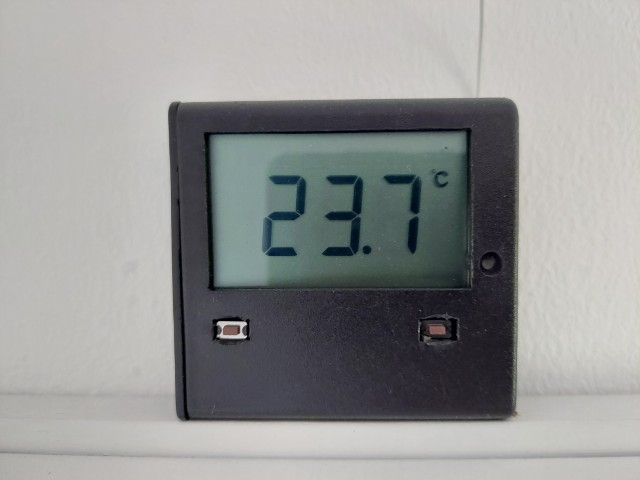
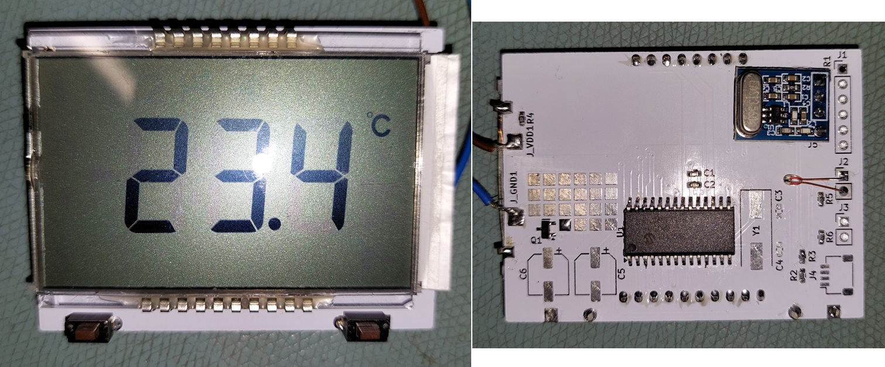

# wireless-thermometer-transmitter-dgl-lcd
PIC firmware and PCB layout for wireless 433MHz temperature transmitter

Integrates with various display devices I've made which share this protocol, including but not limited to [wireless-thermometer-display-esp32](/deveon95/wireless-thermometer-display-esp32). The data format is also compatible with the rfin command on PICAXE microcontrollers.

The PCB is designed to fit in the same space as 3xAA cells so that a battery box can be modified to house it. If using a 4xAA battery box, this leaves room for only one cell so a LiFePO4 cell is ideal in that case.

The LCD is a DGL-0401YG-4EH bare glass LCD with backlight. The backlight is wired in a 2 in series x 2 in parallel configuration; the backlight should be carefully removed, and re-wired with a scalpel and enamel wire with all four LEDs in parallel if it is to light on a 3V battery.

